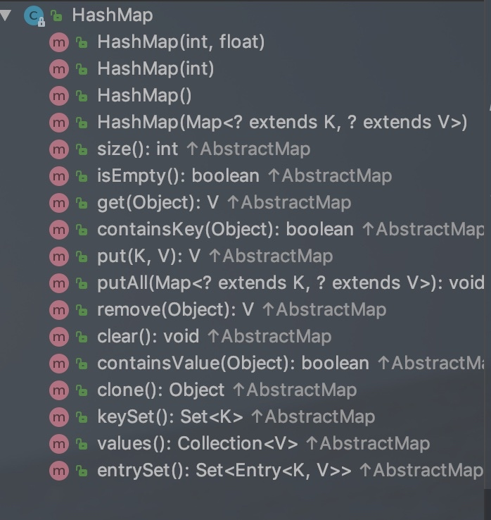
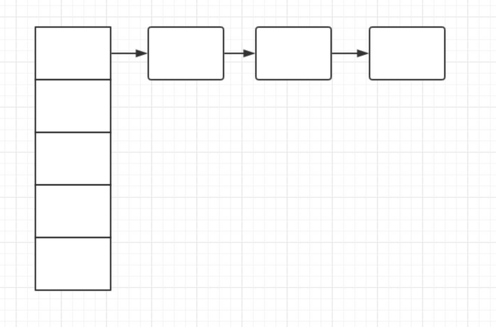

# HashMap源码--JDK1.7版本



[toc]

## HashMap 构造函数
有4个。
除了参数是Map的那个构造函数，其他三个底层实现都是那个两个参数的。

```
public HashMap(int initialCapacity, float loadFactor) 
```
- initialCapacity：
    - 初始容量，默认16
        ```
    /**
     * The default initial capacity - MUST be a power of two.
     */
    static final int DEFAULT_INITIAL_CAPACITY = 1 << 4; // aka 16
    ```
    - 最大是1左移30，因为int最大值是2^31 - 1。 这个数又必须是2的次数。
    
- loadFactor：
    -  荷载系数。默认是0.75

    
## put方法
```
public V put(K key, V value) {
    if (table == EMPTY_TABLE) {
        inflateTable(threshold);
    }
    if (key == null)
        return putForNullKey(value);
    int hash = hash(key);
    int i = indexFor(hash, table.length);
    for (Entry<K,V> e = table[i]; e != null; e = e.next) {
        Object k;
        if (e.hash == hash && ((k = e.key) == key || key.equals(k))) {
            V oldValue = e.value;
            e.value = value;
            e.recordAccess(this);
            return oldValue;
        }
    }

    modCount++;
    addEntry(hash, key, value, i);
    return null;
}
```
###  `table`是个啥

```transient Entry<K,V>[] table = (Entry<K,V>[]) EMPTY_TABLE;```
     
- 是个数组，类型是`Entry<K,V>`，就是底层数据结构中邻接表的数组；
- 如果数组是空的就执行下面的方法`inflateTable`，延迟加载
- 数组长度必须是2的次方


###  `inflateTable(threshold)`做了啥
- 在构造函数里有这么一行`threshold = initialCapacity;`，threshold也就等于HashMap的容量

```
private void inflateTable(int toSize) {
    // Find a power of 2 >= toSize
    int capacity = roundUpToPowerOf2(toSize);

    threshold = (int) Math.min(capacity * loadFactor, MAXIMUM_CAPACITY + 1);
    table = new Entry[capacity];
    initHashSeedAsNeeded(capacity);
}
```
#### 该方法的实现

1. 找到一个数，这个数小于传递过来的`toSize`容量的最大的数，并且这个数必须是2的幂数；  
2. 然后这个数乘以负载系数，跟最大值+1的值 取最小，赋值给threshold；
3. table重新new一个数组，其容量是第1步计算出来的数值，
4. 然后initHashSeedAsNeeded


这里有两个疑问，
1. threshold 是做什么用的？
    初始值在构造函数中设置为了初始容量。 
2. initHashSeedAsNeeded是干啥的

#### 一步步分析
第一步，找到小于map容量的2的次方的最大值
```
private static int roundUpToPowerOf2(int number) {
    // assert number >= 0 : "number must be non-negative";
    return number >= MAXIMUM_CAPACITY
            ? MAXIMUM_CAPACITY
            : (number > 1) ? Integer.highestOneBit((number - 1) << 1) : 1;
}
    
```  

取值逻辑：
number就是map中的容量，number大于等于最大值，取最大值，不大于1的情况下取1，大于1的情况下，取`Integer.highestOneBit((number - 1) << 1)`。所以核心就是`Integer.highestOneBit`这个方法。
其源码展示如下：
```
public static int highestOneBit(int i) {
    // HD, Figure 3-1
    i |= (i >>  1);
    i |= (i >>  2);
    i |= (i >>  4);
    i |= (i >>  8);
    i |= (i >> 16);
    return i - (i >>> 1);
}
```
(小声bb 这都是啥？啥也不是)
取 i 这个数的二进制形式最左边的最高一位且高位后面全部补零，最后返回int型的结果。


###  可以放null值
### hash里边干了啥
### e.recordAccess(this);又是个啥
 
    
    
---
问题：
1. HashMap的底层数据结构是什么
    - 是邻接表，数组加链表的方式
        
    - 

 
2. HashMap 初始容量是多少？最大容量是多少？最大容量为什么是2的30次方，而不是2的31次方？
    - int类型的变量长度为4个字节共32个二进制位，按理说是可以移动31位的。而最高一位是符号位，
3.  

    
